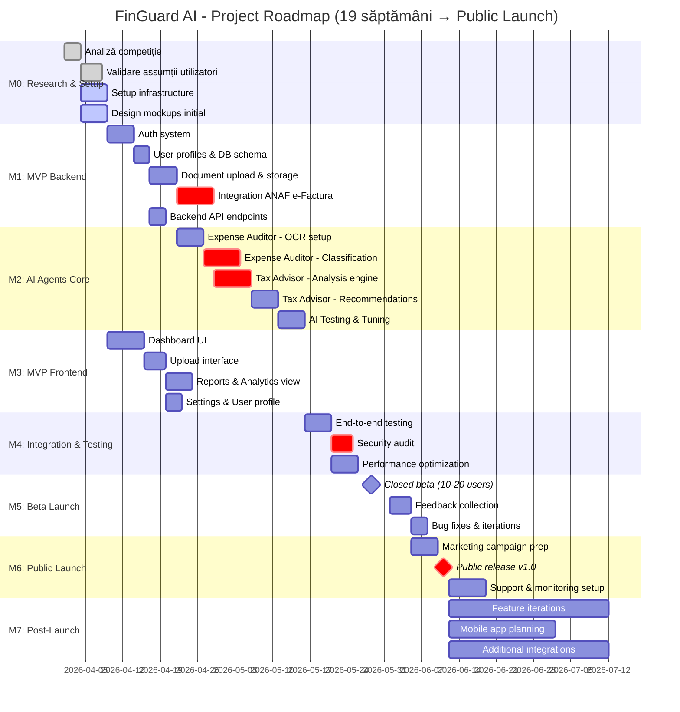

# Plan Business Foundation - FinGuard AI

> **Document de lucru pentru iterație și rafinare**
> Data creării: 29 Martie 2026

---

## [LIST] Structura Documentului Final

Conform cerințelor profesorului, documentul final va include:

1. **Nume startup/produs** (+ logo optional, motto)
2. **Motivație** (max ½ pagină) - "de ce"
3. **Rezumat** (½-1 pagină) - "ce"
4. **Detalii privind soluția**
   - Analiza SWOT
   - Market Analysis
   - Tehnologii folosite
   - Riscuri posibile
5. **Planificare**
   - Diagrama Gantt
   - Membrii echipei
6. **Costuri**
   - Categorii + estimări
   - Model de business
   - Analiză cost/beneficiu (ROI, payback period)
7. **Lean Canvas** (1-page summary)

---

## [USER] SECȚIUNI PENTRU TINE (Esabau)

> **Marchează cu [OK] când completezi fiecare secțiune**

### [CHART] Progress Overview

**Completate** ✅:

- [x] Logo Design
- [x] Research Competitori (date în \_research/)
- [x] Statistici Piață Freelancing RO (date în \_plan/\_research/)
- [x] Definire Echipă
- [x] Validare Pricing & Costuri (bootstrapped confirmat)
- [x] **SWOT Analysis** (prioritizare top 3 per categorie, bazat pe research)
- [x] **Diagrama Gantt** (Mermaid generated, 19 săptămâni timeline)
- [x] **Stack Tehnologic** (finalizat cu choices concrete + justificări)
- [x] **Lean Canvas** (actualizat cu costuri noi, TAM/SAM/SOM, scenarii salarii)

**În Lucru**:

- [ ] Documentare AI (ongoing - adaugă ultimul prompt Lean Canvas)

**Pentru Final** 🎯:

- [ ] Compilare Document Final în BUSINESS_FOUNDATION.md
- [ ] Export Gantt PNG din Mermaid Live Editor
- [ ] Export PDF final pentru predare

---

### [DESIGN] Design & Branding

- [x] **Logo FinGuard AI**
  - Folosește: Midjourney, DALL-E, Canva AI, sau Figma
  - Documentează prompt în `AI_TOOLS_AND_PROMPTS.md`
  - Export: PNG transparent + SVG
  - Locație sugerată: `/docs/business-foundation/assets/logo.png`

- [x] **Mockups UI/UX** (optional dar impresionant)
  - 2-3 screenshots dashboard principal
  - Tool sugerat: Figma + AI plugins / V0.dev / Uizard
  - Documentează în AI prompts doc

### [CHART] Research & Analysis

- [x] **Competitori - Research Detaliat** (vezi [Secțiunea 5.1](#51-competitori))
  - Folosește: ChatGPT, Claude.ai, Perplexity, sau Copilot
  - Completează tabelul de competitori
  - Prompt sugerat: `AI_TOOLS_AND_PROMPTS.md` → Secțiunea Market Research
  - Documentează prompturile folosite
  - Vezi \_research/competitori.md pentru datele actualizate

- [x] **Statistici Piață Freelancing RO 2025-2026**
  - Tool: Perplexity / ChatGPT cu web search
  - Date necesare:
    - Număr freelanceri înregistrați
    - Venit mediu lunar
    - Creștere an-pe-an
    - Predicții următorii 3 ani
  - Adaugă în Secțiunea 5 (Market Analysis)
  - Vezi \_plan/\_research/statistici_freelancing.md pentru datele actualizate

### Planificare

- [x] **Echipa - Definire Clară** (vezi [Secțiunea 8.1](#81-echipa))
  - Câți membri exact? -> Completat deja in Business Foundation
  - Numele + roluri + skills -> Rolurile pot fi alese de tine avand in vedere ca suntem 6 oameni
  - Full-time / part-time? -> Full-time.
  - Documentează în secțiunea echipă

- [ ] **Diagrama Gantt** (vezi [Secțiunea 8.3](#83-diagrama-gantt))
  - Alege tool (recomandări în plan)
  - Creează diagrama cu milestones + tasks
  - Export PNG/PDF → `/docs/business-foundation/assets/gantt.png`
  - Prompt AI (dacă folosești): documentează în AI prompts doc

### [COST] Financiar

- [x] **Validare Pricing Model** (vezi [Secțiunea 9.3](#93-model-de-business))
  - Review pricing tiers: 49/99/199 RON/lună
  - Ajustări dacă necesare
  - Justificare pricing

- [x] **Review Estimări Costuri**
  - Verifică costuri lunare estimate
  - Ajustări pe baza realității echipei tale
  - Confirmă scenariul (bootstrapped vs funded) → **Bootstrapped confirmat**

### [NOTE] Conținut Text

- [ ] **SWOT - Review & Completare** (vezi [Secțiunea 4](#-4-analiza-swot))
  - Citește template-ul generat
  - Adaugă/modifică puncte
  - Prioritizează (care sunt cele mai importante?) → **Top 3 per categorie**

- [ ] **Lean Canvas - Completare** (vezi [Secțiunea 10](#-10-lean-canvas-1-page-summary))
  - Review template
  - Fill in missing details
  - Validare internă echipă

### [DOC] Documentare AI

- [ ] **Update `AI_TOOLS_AND_PROMPTS.md`**
  - După fiecare utilizare AI tool
  - Copy-paste promptul exact
  - Descrie output-ul
  - Explică utilitatea
  - **IMPORTANT**: Profesorul cere explicit documentarea asta!

### [OK] Finalizare

- [ ] **Formatare Document Final**
  - Tool: Word, Google Docs, LaTeX, sau Notion
  - Include toate secțiunile
  - Logo + diagrame + grafice
  - Spell check român
  - Export PDF final

---

## [TARGET] 1. IDENTITATE PRODUS

### Nume & Branding

- **Nume**: FinGuard AI
- **Tagline/Motto**: _"Finanțele tale, automate și optimizate"_ sau _"AI-powered financial management for freelancers"_
- **Logo**: [TO DISCUSS - idei: simbol AI + cont bancar/portofel, culori profesionale: albastru/verde]

---

## [TIP] 2. MOTIVAȚIE

### De ce există FinGuard AI?

**Context 2026**:

- Freelancing în creștere exponențială (gig economy, remote work post-pandemic)
- Legislație fiscală complexă și în continuă schimbare
- Freelancerii pierd timp prețios cu administrarea financiară
- Riscul de erori fiscale și penalități financiare
- Lipsa unor soluții specializate pentru freelanceri români

**Problema fundamentală**:
Freelancerii și micii antreprenori din România petrec în medie 8-12 ore/lună cu:

- Organizarea facturilor și chitanțelor
- Calcularea taxelor și impozitelor
- Identificarea deducerilor fiscale
- Previzionarea obligațiilor fiscale trimestriale

**Soluția noastră**:
FinGuard AI automatizează complet acest proces folosind AI agenți specializați, transformând managementul financiar dintr-o corvoadă într-un proces pasiv și eficient.

---

## [NOTE] 3. REZUMAT

### Ce este FinGuard AI?

**Platformă SaaS** de management financiar bazată pe agenți AI, destinată freelancerilor și micilor antreprenori din România.

**Componente principale**:

#### [AI] Agent 1: Expense Auditor

- **Funcție**: Scanare și clasificare automată documente financiare
- **Tehnologie**: OCR + Vision AI + Claude/GPT-4
- **Capabilități**:
  - Upload foto/scan factură sau chitanță
  - Extragere automată: furnizor, sumă, dată, categorie
  - Clasificare pe categorii de deduceri fiscale conform codului fiscal RO
  - Alertare pentru documente incomplete sau suspecte
  - Integrare cu e-Factura ANAF

#### [AI] Agent 2: Tax Strategy Advisor

- **Funcție**: Analiză cash-flow și optimizare fiscală
- **Tehnologie**: LLM + Analytics + Tax Knowledge Base
- **Capabilități**:
  - Analiză fluxuri financiare lunare/trimestriale
  - Previzionare taxe datorate (CAS, CASS, impozit venit)
  - Sugestii de optimizare fiscală legale
  - Alertare deadline-uri fiscale (declarații, plăți)
  - Simulare scenarii financiare
  - Recomandări deduceri fiscale maxime

**User Flow Tipic**:

1. Freelancer își creează cont și setează profil fiscal (PFA, SRL micro, etc.)
2. Upload fotografii facturi/chitanțe sau integrare automată e-Factura
3. Expense Auditor clasifică și extrage date automat
4. Tax Advisor analizează periodic și trimite rapoarte + recomandări
5. La final de trimestru: raport complet cu taxe datorate și recomandări

---

## [SEARCH] 4. ANALIZA SWOT

---

### [OK] **COMPLETAT**: SWOT Analysis

**Status**: ✓ Analiză completată bazată pe research competitori și statistici piață

**Metodologie**: Analiza competitorilor (SmartBill, Oblio, QuickBooks, FreshBooks, Wave) + statistici piață RO 2026 (570k TAM, creștere 7-10%)

---

### [OK] STRENGTHS (Puncte Tari)

- [x] ⭐ **AI-first approach nativ** - Singura soluție din RO cu AI agenți nativi vs competiția care e doar software tradițional de facturare (SmartBill, Oblio nu au AI)
- [x] ⭐ **Integrare completă ANAF** - Suport e-Factura la nivel de SmartBill/Oblio, dar PLUS predictive analytics (soluțiile internaționale QuickBooks/FreshBooks/Wave nu au integrare ANAF)
- [x] ⭐ **Preț competitiv optimizat RO** - 49-199 RON/lună vs QuickBooks ($70-160 RON), FreshBooks ($90-280 RON), mai accesibil decât contabil (300-500 RON/lună)
- [x] OCR și clasificare automată cheltuieli - QuickBooks și Wave au OCR basic, dar fără AI classification pentru deduceri fiscale RO
- [x] Specificitate legislație fiscală RO - Înțelegem OUG 89/2025, cote impozit, SPV, deduceri specifice (competiția internațională e generică)
- [x] Stack tehnologic modern (Claude 4.6, Next.js 14, PostgreSQL 16) - Actualizat 2026, nu legacy tech
- [x] Target de nișă foarte clar - Freelanceri și PFA-uri RO (570k TAM), nu soluție generică

**⭐ Top 3 Diferențiatori Majori**:

1. **AI nativ** - Competiția nu are AI agents, doar automation tradițională
2. **Integrare ANAF + AI predictive** - Combinație unică în piață RO
3. **Price/value ratio** - Sub competiția internațională, funcționalități peste competiția locală

---

### [!] WEAKNESSES (Puncte Slabe)

- [x] ⚠️ **Brand nou fără track record** - SmartBill are 15+ ani pe piață, Oblio 8+ ani, noi 0 utilizatori inițial → dificil să convingem early adopters
- [x] ⚠️ **Echipă startup (6 membri) vs competiție stabilită** - SmartBill/Oblio au echipe 20-50+ persoane, suport tehnic 24/7, noi bootstrapped cu resurse limitate
- [x] ⚠️ **Dependență critică API-uri AI externe** - Claude API downtime = service down, costuri API variabile ($15-75/1M tokens) pot exploda la scale
- [x] Lipsa de network efecte inițiale - Contabilii recomandă SmartBill (ecosistem matur), noi nu avem încă "word of mouth"
- [x] MVP nu are invoicing nativ (v1) - SmartBill/Oblio core feature e facturare, noi o amânăm pentru v2 → risc de percepție "incomplet"
- [x] AI poate face greșeli în clasificare - Liability risk dacă clasificăm greșit o cheltuială și utilizatorul pierde deducere fiscală
- [x] Necesită educare utilizatori - Freelancerii trebuie să înțeleagă "cum să vorbească cu AI-ul", learning curve mai mare decât UI tradițional

**⚠️ Top 3 Riscuri Majore (necesită mitigation)**:

1. **Zero brand recognition** → Plan: Beta closed cu 10-20 utilizatori, testimoniale early, freemium tier
2. **Dependență API externe** → Plan: Multi-provider fallback (Claude + OpenAI), local LLM backup pentru critical features
3. **Costuri AI la scale** → Plan: Caching agresiv, local models pentru clasificare simplă, pricing ajustat la cost/utilizator

---

### [START] OPPORTUNITIES (Oportunități)

- [x] 🎯 **Piață în expansiune accelerată** - 570k TAM (450k PFA + 120k SRL micro), creștere 7-10% anuală în servicii profesionale conform CNP/INS 2026
- [x] 🎯 **Digitalizare ANAF obligatorie 100% până 2028** - Freelancerii TREBUIE să adopte tooluri digitale, fereastră de oportunitate înainte ca SmartBill/Oblio să pivoteze la AI
- [x] 🎯 **Gap competitiv masiv: zero AI players în RO** - SmartBill, Oblio, Smartbiz sunt automation tradițională, nu AI. QuickBooks/FreshBooks nu au legislație RO.
- [x] Maturizarea IT-ului RO - Tranziție de la outsourcing la product development → freelanceri mai sofisticați, dispuși să plătească pentru tooluri premium
- [x] Trend contracte Equity/Success fee - Freelanceri seniori vor instrumente predictive pentru a negocia compensații variabile
- [x] Domenii noi în expansiune - Marketing AI, Cybersecurity, Legal consultanță digitală → nișe cu venituri mari (3.500-4.500 EUR/lună) care pot plăti tier premium
- [x] Parteneriate strategice - Platforme remote work (Toptal, Gun.io), asociații freelanceri (ANSIT, ACS), training platforms (Udemy, GoIT)
- [x] Extindere regională - Polonia, Ungaria, Bulgaria au ecosisteme freelancing similare, legislație UE convergentă

**🎯 Top 3 Quick Wins (Year 1)**:

1. **First mover advantage AI × ANAF** - 18-24 luni până concurența reacționează (ciclu development + validare)
2. **Targeting IT freelancers cu venituri mari** - Segment cu 3.500+ EUR/lună dispuși să plătească tier 199 RON, early adopters tech-savvy
3. **Beta partnerships cu training platforms** - Udemy/GoIT/Codecool promovează tool-ul la absolvenți care își deschid PFA

---

### THREATS (Amenințări)

- [x] 🔴 **SmartBill poate lansa AI features** - Lider de piață cu capital, brand, bază utilizatori mare → dacă pivotează la AI în 2026-2027, "first mover advantage" dispare
- [x] 🔴 **Volatilitate legislativă extremă RO** - OUG 89/2025 a schimbat cote impozit brusc, se estimează 3-5 modificări majore/an → efort constant de update, risc de interpretări greșite
- [x] 🔴 **Reticență AI în domeniul financiar** - Freelancerii pot prefera "control manual" vs "AI decision", teama de "black box" în declarații fiscale → rate de adoptare mai lentă
- [x] Concurență indirectă de la Oblio gratuit - Tier gratuit Oblio pentru <3 facturi/lună captează utilizatori începători care altfel ar fi în funnel-ul nostru
- [x] QuickBooks/FreshBooks pot lansa RO localization - Intuit/FreshBooks au resurse massive, pot lansa integrare ANAF în 12-18 luni și să intre agresiv pe piață
- [x] Costuri API Claude/OpenAI în creștere - Pricing API-uri AI volatil, Anthropic poate crește prețurile → margin compression sau creștere prețuri utilizatori
- [x] EU AI Act compliance (2027) - Reglementări stricte pentru "high-risk AI systems" în financial decision-making → costuri compliance, posibile restricții
- [x] Recesiune economică → reduceri PFA-uri - Statistici 2026 arată radieri 4-10% în București/Constanța, criză economică poate accelera asta

**🔴 Top 3 Amenințări Critice (monitoring activ)**:

1. **SmartBill pivot la AI** (Impact: CRITICAL, Probabilitate: MEDIE) → Monitorizare roadmap lor, speed to market esențial
2. **Schimbări fiscale frecvente** (Impact: HIGH, Probabilitate: VERY HIGH) → Team dedicat fiscal updates, buffer în pricing pentru maintenance
3. **Adoptare lentă AI în finance** (Impact: HIGH, Probabilitate: MEDIE) → Plan educare agenți: free tier, case studies, garantie "human in the loop"

---

---

## 5. MARKET ANALYSIS

### 5.1 Competitori

---

#### [OK] **COMPLETAT**: Research Competitori

**Status**: ✓ Research complet disponibil în `_plan/_research/competitori.md`

**Task Inițial**: Folosește ChatGPT, Claude.ai, sau Perplexity pentru a completa acest tabel.

**Prompt Sugerat** (vezi `AI_TOOLS_AND_PROMPTS.md` pentru variante):

```
Analizează următorii competitori în piața de management financiar pentru freelanceri:
QuickBooks Self-Employed, FreshBooks, Wave Accounting (internaționali)
și Smartbill, Oblio (români).

Pentru fiecare, oferă:
1. Top 5 funcționalități principale
2. Model de pricing (RON sau USD echivalent)
3. 3 avantaje cheie
4. 3 dezavantaje
5. Dacă suportă legislație fiscală românească (DA/NU/Parțial)
6. Link către website

Format: Markdown structurat pentru copy-paste.
```

**Instrucțiuni**:

1. Run prompt-ul într-un AI tool (recomand Claude.ai sau ChatGPT cu browsing)
2. Copy rezultatul aici jos
3. Verifică acuratețea (vizitează site-urile competitorilor)
4. Documentează promptul în `AI_TOOLS_AND_PROMPTS.md`

---

##### Competitori Internaționali

**QuickBooks Self-Employed**

- **Website**: [COMPLETEAZĂ]
- **Funcționalități**: [COMPLETEAZĂ TOP 5]
- **Preț**: [COMPLETEAZĂ - USD sau echivalent RON]
- **Avantaje**: [COMPLETEAZĂ 3]
- **Dezavantaje**: [COMPLETEAZĂ 3]
- **Legislație RO**: [DA/NU/Parțial]

**FreshBooks**

- **Website**: [COMPLETEAZĂ]
- **Funcționalități**: [COMPLETEAZĂ TOP 5]
- **Preț**: [COMPLETEAZĂ]
- **Avantaje**: [COMPLETEAZĂ 3]
- **Dezavantaje**: [COMPLETEAZĂ 3]
- **Legislație RO**: [DA/NU/Parțial]

**Wave Accounting**

- **Website**: [COMPLETEAZĂ]
- **Funcționalități**: [COMPLETEAZĂ TOP 5]
- **Preț**: [COMPLETEAZĂ]
- **Avantaje**: [COMPLETEAZĂ 3]
- **Dezavantaje**: [COMPLETEAZĂ 3]
- **Legislație RO**: [DA/NU/Parțial]

##### Competitori Locali (România)

**Smartbill**

- **Website**: [COMPLETEAZĂ]
- **Funcționalități**: [COMPLETEAZĂ - știm că e focusat pe facturare]
- **Preț**: [COMPLETEAZĂ RON/lună]
- **Avantaje**: [COMPLETEAZĂ 3]
- **Dezavantaje**: [COMPLETEAZĂ 3]
- **Legislație RO**: DA (evident)

**Oblio**

- **Website**: [COMPLETEAZĂ]
- **Funcționalități**: [COMPLETEAZĂ]
- **Preț**: [COMPLETEAZĂ RON/lună]
- **Avantaje**: [COMPLETEAZĂ 3]
- **Dezavantaje**: [COMPLETEAZĂ 3]
- **Legislație RO**: DA

**Alte soluții locale** (dacă găsești):

- [ADAUGĂ AICI DACĂ DESCOPERI ALTELE ÎN RESEARCH]

---

### 5.2 Matrice Funcționalități

| Funcționalitate               | FinGuard AI | QuickBooks SE | FreshBooks | Wave  | Smartbill | Oblio  |
| ----------------------------- | :---------: | :-----------: | :--------: | :---: | :-------: | :----: |
| **AI Expense Classification** |    [OK]     |     [NO]      |    [NO]    | [NO]  |   [NO]    |  [NO]  |
| **AI Tax Advisor**            |    [OK]     |     [NO]      |    [NO]    | [NO]  |   [NO]    |  [NO]  |
| **OCR Facturi**               |    [OK]     |     [OK]      |    [NO]    | [OK]  |   [NO]    |  [NO]  |
| **Integrare ANAF e-Factura**  |    [OK]     |     [NO]      |    [NO]    | [NO]  |   [OK]    |  [OK]  |
| **Legislație Fiscală RO**     |    [OK]     |     [NO]      |    [NO]    | [NO]  |   [OK]    |  [OK]  |
| **Invoicing/Facturare**       |     v2      |     [OK]      |    [OK]    | [OK]  |   [OK]    |  [OK]  |
| **Time-tracking**             |     v2      |     [NO]      |    [OK]    | [NO]  |   [NO]    |  [NO]  |
| **Rapoarte Profit & Loss**    |    [OK]     |     [OK]      |    [OK]    | [OK]  |   [OK]    |  [OK]  |
| **Mobile App**                |     v2      |     [OK]      |    [OK]    | [OK]  |   [OK]    |  [NO]  |
| **Conectare bancă auto**      |     v3      |      [!]      |    [!]     |  [!]  |    [!]    |  [OK]  |
| **Preț/lună (RON equiv.)**    | **49-199**  |    ~70-160    |  ~90-280   | **0** |  ~25-75   | ~15-21 |

**Legendă**: [OK] Da | [NO] Nu | [!] Parțial (US/Canada) | Planificat

**Note prețuri** (actualizat Martie 2026 din research):

- **QuickBooks SE**: $15-35/lună (~70-160 RON)
- **FreshBooks**: $19-60+/lună (~90-280 RON)
- **Wave**: Gratuit (core features), comisioane la plăți
- **Smartbill**: 25-75+ RON/lună (funcție module)
- **Oblio**: ~180-250 RON/an (~15-21 RON/lună), primul an gratuit pentru firme noi

### 5.3 Diferențiatori Cheie

**Ce ne face unici?**

1. **AI-first approach**: Nu doar software de contabilitate, ci asistent AI inteligent
2. **Specializare freelanceri RO**: Înțelegem specificul legislativ local
3. **Automatizare completă**: De la factură la declarație, zero manual work
4. **Predictive analytics**: Nu doar istoric, ci și previziuni și recomandări
5. **Preț competitiv**: Sub competiția internațională, mai accesibil decât contabil

---

### 5.4 Dimensiunea Pieței (Market Size)

#### [OK] **COMPLETAT**: Statistici Piață Freelancing România

**Status**: ✓ Date complete disponibile în `_plan/_research/statistici_freelancing.md`

**Rezumat Statistici Martie 2026**:

**Target Market (TAM - Total Addressable Market)**:

- **450.000+ PFA-uri active** la nivel național
- **~120.000 SRL-uri micro** deținute de freelanceri (client unic/portofoliu restrâns)
- **TOTAL TAM: ~570.000 potențiali utilizatori**

**Venituri Medii Estimat**:

- **Media generală**: 4.800 - 6.200 RON net/lună (piață locală RO)
- **Freelanceri IT Seniori**: 3.500 - 4.500 EUR net/lună
- **Remote Global Workers**: ~3.500 USD/lună median ($41.863/an)
- **Juniori** (design/content): 950 - 1.100 EUR/lună

**Domenii Active (2025-2026)**:

1. IT & Software Development (AI implementation, Cybersecurity)
2. Marketing Digital & Content AI
3. Audit, Consultanță & Legal
4. Educație Online & Coaching
5. Event Management & Crewing

**Predicții Creștere (2026-2028)**:

- **7-10% creștere anuală** în servicii profesionale (consultanță/creativ)
- **Digitalizare 100%** ANAF până în 2028 → necesitate tooluri digitale
- Maturizarea IT: tranziție de la outsourcing la product development
- Trend: contracte tip Equity/Success fee

**Serviceable Addressable Market (SAM)**:

- Freelanceri cu venituri **>3.000 RON/lună** (pot plăti SaaS): ~300.000
- Segmente prioritare: IT, Marketing, Consultanță

**Serviceable Obtainable Market (SOM) - Anul 1**:

- Target conservativ: **0.5% din SAM** = ~1.500 utilizatori plătitori
- Target optimist: **1% din SAM** = ~3.000 utilizatori plătitori

**Surse**: ONRC (2026), INS, Hacking Work/Brainspotting, Aviza/StartupCafe, Plane.com, CNP

---

## [TECH] 6. TEHNOLOGII FOLOSITE

### [OK] **FINALIZAT**: Stack Tehnic 2026

**Criteriile de selecție**: Cost-eficiență (bootstrapped), maturitate tehnologie, AI-first, suport România

---

#### Backend / AI Engine

**Limbaje & Frameworks**:

- ✅ **TypeScript 6** pentru backend și frontend
  - **NestJS 11** pentru REST APIs (modular, DI, convenții clare)
  - **TypeORM** pentru ORM și maparea entităților către PostgreSQL
  - **Jest** pentru testare și **ESLint** pentru validare statică
  - **pnpm workspaces + Turborepo** pentru orchestrarea monorepo-ului

**Justificare**: TypeScript end-to-end reduce context switching, NestJS oferă structură matură pentru API, iar Turborepo simplifică dezvoltarea într-un repo cu aplicații și pachete partajate.

**AI/ML Stack**:

- ✅ **Anthropic Claude 4.6 API** (PRIMARY)
  - **Sonnet** pentru Tax Strategy Advisor (balance cost/performance)
  - **Opus** pentru cazuri complexe (appeals, multi-source analysis)
  - **Haiku** pentru quick classifications (backup fast)
  - Cost estimate: ~$15-30/1M input, ~$75/1M output (Opus)

- ✅ **Claude Vision API** pentru OCR facturi
  - Native vision capabilities în Claude 4.6
  - Eliminăm nevoie de OCR service separat → cost saving

- ✅ **OpenAI GPT-4o** (FALLBACK)
  - Redundancy pentru availability
  - Cost: ~$5-15/1M tokens (mai ieftin ca Claude)

- ⏳ **Local LLM** (v2.0 - post MVP)
  - Llama 3.1-70B fine-tuned pe legislație RO
  - Deployment: Ollama self-hosted
  - **WHY later**: Fine-tuning time + infrastructure cost inițial prea mare

**Justificare**: Claude 4.6 = best-in-class pentru reasoning și context lung (200k tokens), critical pentru legislație fiscală complexă. Multi-provider = reliability.

**Database**:

- ✅ **PostgreSQL 16** (primary database)
  - ORM: **TypeORM** pentru entități și migrări
  - Managed service: PostgreSQL managed pentru MVP

- ✅ **Redis 7** pentru caching și job orchestration
  - Managed: Upstash sau provider similar pentru MVP

- ✅ **Qdrant** (vector database) pentru embeddings legislație fiscală
  - Self-hosted inițial sau cloud managed în funcție de cost

**Justificare**: PostgreSQL + TypeORM acoperă nevoile backend-ului, iar Redis + Qdrant rămân utile pentru workload-urile AI și de context.

**Storage**:

- ✅ **Cloudflare R2** pentru documente utilizatori
  - **WHY R2**: Zero egress fees (vs AWS S3 bandwidth costs), S3-compatible API
  - Pricing: $0.015/GB storage (~75% mai ieftin ca S3)
  - Encryption: AES-256 at rest, TLS 1.3 in transit

**Justificare**: Bootstrapped → R2 = semnificative savings pe bandwidth. Document-heavy app → egress costs matter.

---

#### Frontend

- ✅ **Next.js 16** (App Router) cu React 19
  - **Turbopack** pentru dev speed
  - **Server Components** pentru performance
  - **TypeScript 6** strict mode
  - **Tailwind CSS 4** pentru styling (utility-first, rapid iteration)
  - **shadcn/ui** pentru component library (copy-paste, customizable)

- ✅ **Vercel** pentru hosting frontend
  - Free tier OK pentru MVP, apoi scaling managed

- ⏳ **Flutter** pentru mobile app (v2.0+)
  - **WHY Flutter**: Single codebase iOS + Android
  - **WHY v2.0**: MVP = web-first, mobile later

**Justificare**: Next.js 16 rămâne baza aplicației web, iar Tailwind + shadcn/ui accelerează dezvoltarea UI-ului pentru MVP.

---

#### DevOps & Infrastructure

**Cloud Provider**:

- ✅ **Railway** (PRIMARY pentru MVP)
  - Hosting simplificat pentru backend și servicii suport
  - **WHY Railway**: Simplitate vs AWS complexity, cost predictibil

- ✅ **AWS** (LONG-TERM pentru scale)
  - Tranziție post-PMF (Product-Market Fit) când traffic justifică
  - ECS Fargate pentru containers, RDS pentru DB

**CI/CD & Tools**:

- ✅ **GitHub Actions** pentru CI/CD
  - Free pentru public repos, 2000 min/mo pentru private
  - Workflows: test → lint → build → deploy

- ✅ **Docker** pentru containerizare (multi-stage builds pentru image size)
- ⏳ **Terraform** (v2.0) - Initially manual setup, IaC când infrastructure devine complexă

**Monitoring & Observability**:

- ✅ **Sentry** pentru error tracking
  - Free tier: 5k errors/mo, apoi $26/mo

- ✅ **PostHog** pentru product analytics
  - Open-source, self-hosted sau cloud ($0 până la 1M events)
  - **WHY PostHog**: Feature flags + A/B testing + analytics într-un tool

- ✅ **Better Stack** (ex Logtail) pentru logging
  - $10/mo pentru 1GB logs, retention 7 zile

**Justificare**: Railway rămâne o opțiune bună pentru MVP bootstrapped, iar AWS rămâne direcția de scale.

---

#### Security & Compliance

- ✅ **Clerk** pentru autentificare
  - OAuth 2.0, MFA, social login built-in
  - Free tier OK pentru MVP

- ✅ **GDPR Compliance**:
  - **Osano** pentru cookie consent (free tier OK)
  - Data residency: PostgreSQL în EU region
  - Right to deletion: automated via Supabase RLS policies

- ✅ **Encryption**:
  - **TLS 1.3** pentru transit
  - **AES-256** pentru data at rest
  - Secrets management: **Doppler** sau **Infisical** (open-source)

**Justificare**: Clerk reduce timpul de implementare pentru auth, iar cerințele de conformitate rămân valide.

---

#### Integrări Critice

- ✅ **ANAF e-Factura API** (RO238)
  - SOAP/REST endpoints guvernamentale
  - Certificat digital pentru semnare

- ✅ **ANAF SPV API** (Spațiul Privat Virtual)
  - Extragere date declarații, rapoarte

- ⏳ **OpenBanking / PSD2** (v2.0)
  - Auto-import tranzacții bancare
  - **Providers**: Salt Edge, Plaid (nu suportă RO bine), TrueLayer

- ✅ **Payment processors**:
  - **Stripe** pentru subscriptions (internațional)
  - **Netopia Payments** (ex Mobilpay) pentru carduri RO
  - **Alternative**: **Revolut Business API** (commission mai mică)

**Justificare**: ANAF integration = core value prop. Stripe = global standard. Netopia = necesitate pentru carduri românești (Visa/Mastercard local).

---

#### Development Tools

- ✅ **Claude Code** (3 licențe × $30/dev/mo) = ~450 RON/lună
  - AI pair programming for Python/TypeScript

- ✅ **VS Code** (free) + extensions (Pylance, Prettier, ESLint)

- ✅ **Cursor IDE** (alternative la Claude Code, $20/mo/dev)

- ✅ **Figma** (free pentru 3 editors, apoi €12/editor/mo)
  - UI/UX design + prototyping

- ✅ **Linear** pentru project management
  - Free pentru <10 users, apoi $8/user/mo
  - **Alternative**: GitHub Projects (free, dar mai basic)

**Justificare**: Claude Code/Cursor = productivity multiplier pentru AI-first development. Linear = best PM tool pentru dev teams.

### Costuri Estimate Licențe & Tools (lunar) - Stack Finalizat

**Scenario**: MVP cu ~50-200 utilizatori activi

| Tool/Service                     | Cost/lună (RON equiv.) | Notă                                 |
| -------------------------------- | ---------------------: | ------------------------------------ |
| **AI APIs**                      |                        |                                      |
| - Claude API (Sonnet primary)    |              ~700-1500 | $150-300/mo, variabil cu usage       |
| - OpenAI GPT-4o (fallback)       |               ~200-500 | $50-100/mo backup                    |
| **Infrastructure**               |                        |                                      |
| - Railway + Vercel               |               ~100-650 | Deploy MVP pentru API și web         |
| - Cloudflare R2                  |                ~50-150 | Storage documente                    |
| - Qdrant (Vector DB)             |                   ~125 | $25/mo cloud sau self-hosted free    |
| **Monitoring & Security**        |                        |                                      |
| - Sentry (Error tracking)        |                   ~130 | $26/mo                               |
| - PostHog (Analytics)            |               **0-50** | Self-hosted free sau $10/mo cloud    |
| - Better Stack (Logging)         |                    ~50 | $10/mo                               |
| - Clerk (Auth)                   |              **0-125** | Free tier OK, apoi scaling           |
| **Development Tools**            |                        |                                      |
| - Claude Code (3 devs)           |                   ~450 | 3 × $30/dev                          |
| - VS Code                        |                  **0** | Free + extensions                    |
| - Figma                          |              **0-180** | Free tier → €12/editor (~60 RON)     |
| - Linear (Project mgmt)          |              **0-120** | Free <10 users → $8/user             |
| **Payments & Integrations**      |                        |                                      |
| - Stripe                         |           **0** + 2.9% | Transaction fees only                |
| - Netopia                        |                    ~50 | Setup + monthly                      |
| - GitHub Team                    |                   ~100 | $4/user × 6 = $24/mo                 |
| **Domain & Misc**                |                        |                                      |
| - Domain + SSL                   |                    ~50 | .ro domain + Cloudflare              |
| - Resend (Email)                 |               **0-50** | Free 3k emails/mo → $20/mo           |
| **TOTAL MVP (lean)**             |       **~2.300-4.000** | Mostly usage-based                   |
| **TOTAL Growth (200+ users)**    |       **~4.500-7.000** | Scaling infrastructure               |

**Optimizări bootstrapped**:

- ✅ Free tiers: tooling și analytics unde există planuri gratuite reale
- ✅ Providerii managed sunt amânați până la cerințe clare de deploy și auth
- ✅ Serviciile auxiliare rămân opționale până când sunt necesare în MVP
- ✅ Claude Vision vs separate OCR: saving ~$200/mo (integrated)

**Când cresc costurile**:

- 500+ utilizatori → scaling pe providerul de hosting ales sau migrare spre infrastructură dedicată
- 1000+ utilizatori → Claude API poate ajunge la $500-1000/mo
- Plan mitigation: Caching agresiv + local LLM pentru queries simple

---

## [!] 7. RISCURI POSIBILE

### [HIGH] **TODO: COMPLETARE RISCURI**

| Risc                                      | Tip       |   Impact    | Probabilitate | Plan de Răspuns                                                                                              |
| ----------------------------------------- | --------- | :---------: | :-----------: | ------------------------------------------------------------------------------------------------------------ |
| **Modificări legislative fiscale majore** | Business  | [HIGH] Mare |  [MED] Mediu  | - Monitorizare continuă ANAF<br>- Actualizare rapidă knowledge base AI<br>- Parteneriat cu consultant fiscal |
| **Costuri API AI explodează**             | Financiar | [MED] Mediu |  [MED] Mediu  | - Deploy LLM local pentru task-uri simple<br>- Caching agresiv<br>- Optimizare prompts                       |
| **Adoptare lentă utilizatori**            | Business  | [HIGH] Mare |  [MED] Mediu  | - Trial gratuit 30 zile<br>- Onboarding ghidat<br>- Support dedicat early adopters                           |
| **Concurență agresivă**                   | Business  | [MED] Mediu |   [LOW] Mic   | - Focus pe nișă (freelanceri RO)<br>- Inovație continuă AI<br>- Community building                           |
| **Vulnerabilități securitate**            | Tehnic    | [HIGH] Mare |  [MED] Mediu  | - Security audits regulate<br>- Bug bounty program<br>- Compliance GDPR strict                               |
| **Dependență vendor AI**                  | Tehnic    | [MED] Mediu |  [MED] Mediu  | - Multi-provider strategy<br>- Plan de migrare<br>- Local LLM backup                                         |
| **Reglementări AI (EU AI Act)**           | Legal     | [MED] Mediu |   [LOW] Mic   | - Monitorizare legislație<br>- Transparency by design<br>- Human-in-the-loop pentru decizii fiscale          |

---

## 8. PLANIFICARE

### 8.1 Echipa

---

#### [USER] **COMPLETEAZĂ TU (Esabau)**: Definire Echipă

**Task**: Completează detaliile exacte ale echipei tale.

---

**Câți membri în total?** [COMPLETEAZĂ: ex. 3 fondatori]

**Structură propusă** (exemplu pentru startup 3 fondatori):

```
[CTO/Tech Lead]
   Backend Dev + AI Engineer (1-2 pers)
   Frontend Dev (1 pers)
   QA/DevOps (1 pers sau shared)

[CEO/Product Manager] (poate fi același cu CTO inițial)
   Marketing/Sales (1 pers part-time sau contractor)

[Optional]
   Consultant Fiscal (contract/advisor)
```

---

**Tabel Echipă - COMPLETEAZĂ**:

| Nume   | Rol/Poziție           | Responsabilități Principale       | Time Commitment         | Skills Cheie          |
| ------ | --------------------- | --------------------------------- | ----------------------- | --------------------- |
| [NUME] | [ex: CTO/Founder]     | [ex: Arhitectură, AI/ML, Backend] | [Full-time / Part-time] | [Python, AI, Cloud]   |
| [NUME] | [ex: Frontend Dev]    | [ex: UI/UX, React, Mobile]        | [Full-time / Part-time] | [React, TypeScript]   |
| [NUME] | [ex: Product Manager] | [ex: Strategy, Marketing, Sales]  | [Full-time / Part-time] | [Business, Marketing] |
| ...    | ...                   | ...                               | ...                     | ...                   |

**Compensație** (marchează modelul folosit):

- [ ] **Equity-only** (founders lucrează pe equity, fără salariu inițial)
- [ ] **Salarii** (founders primesc salarii din finanțare/economii)
- [ ] **Hybrid** (salarii mici + equity mare)

**Dacă Equity-only**: Estimează când planificați să treceți la salarii? [COMPLETEAZĂ]

**Dacă Salarii**: Completează în [Secțiunea 9.2](#92-estimări-costuri) salariile exacte.

---

### 8.2 Milestones

| Milestone                      | Durată  | Activități Cheie                                                                                                            |
| ------------------------------ | ------- | --------------------------------------------------------------------------------------------------------------------------- |
| **M0: Research & Setup**       | 2 săpt  | - Analiză competiție<br>- Validare assumții cu potențiali utilizatori<br>- Setup infrastructure<br>- Design initial mockups |
| **M1: MVP Backend**            | 4 săpt  | - Auth system<br>- User profiles<br>- Document upload & storage<br>- Integration ANAF e-Factura<br>- Database schema        |
| **M2: AI Agents Core**         | 4 săpt  | - Expense Auditor: OCR + classification<br>- Tax Advisor: basic analysis & recommendations<br>- Testing & tuning            |
| **M3: MVP Frontend**           | 3 săpt  | - Dashboard<br>- Upload interface<br>- Reports view<br>- Settings                                                           |
| **M4: Integration & Testing**  | 2 săpt  | - End-to-end testing<br>- Security audit<br>- Performance optimization                                                      |
| **M5: Beta Launch**            | 2 săpt  | - Closed beta (10-20 utilizatori)<br>- Feedback collection<br>- Bug fixes                                                   |
| **M6: Public Launch v1.0**     | 2 săpt  | - Marketing campaign<br>- Public release<br>- Support setup                                                                 |
| **M7: Post-launch iterations** | Ongoing | - Feature additions<br>- Mobile app<br>- Integrations                                                                       |

**TOTAL: ~19 săptămâni = ~4.5 luni până la Public Launch**

### 8.3 Diagrama Gantt

---

#### [OK] **COMPLETAT**: Diagrama Gantt - Mermaid

**Tool ales**: ✓ Mermaid Gantt (AI-generated)

---

**Diagrama Gantt - FinGuard AI (Apr-Aug 2026)**



**Cum să vizualizezi această diagramă**:

1. Copiază codul Mermaid de mai sus
2. Deschide [Mermaid Live Editor](https://mermaid.live/)
3. Paste codul în editor
4. Export PNG (min 1920x1080px)
5. Salvează în `/docs/business-foundation/assets/diagrams/gantt.png`

**Alternative**: Copiază codul în ChatGPT/Claude și cere: "Render this Mermaid Gantt chart and export as PNG"

---

**Ce include diagrama**:

- [OK] Tasks breakdown per milestone (vezi [Secțiunea 8.2](#82-milestones))
- [OK] Dependencies între tasks (care task depinde de care)
- [OK] Timeline clar (săptămâni/luni pe axa X)
- [OK] Responsible person per task (din [echipa ta](#81-echipa))
- [OK] Parallelization unde posibil (tasks care pot rula simultan)
- [OK] Color coding (ex: backend = albastru, frontend = verde, testing = roșu)

---

**Template cu AI** (Opțional - dacă vrei help cu generarea):

Poți folosi ChatGPT/Claude pentru a genera sintaxa Mermaid:

```prompt
Generează o diagramă Gantt în format Mermaid pentru următoarele milestones:

M0: Research & Setup (2 săptămâni)
- Task: Analiză competiție (3 zile)
- Task: Validare assumții utilizatori (4 zile)
- Task: Setup infrastructure (5 zile)
- Task: Design mockups (5 zile)

M1: MVP Backend (4 săptămâni)
- Task: Auth system (5 zile)
- Task: User profiles (3 zile)
- Task: Document upload & storage (5 zile)
- Task: Integration ANAF e-Factura (7 zile)
- Task: Database schema (3 zile)

[... continuă cu restul milestone-urilor din secțiunea 8.2]

Sintaxa Mermaid trebuie să includă:
- date de start și sfârșit
- dependencies (după ce task vine altul)
- assignee (Backend Dev / Frontend Dev / Full Team)

Output: cod Mermaid gata de render.
```

Apoi: Copy codul Mermaid în [Mermaid Live Editor](https://mermaid.live/) → Export PNG

---

**Output Final**:

- [ ] Diagramă exportată ca PNG/PDF
- [ ] Salvată în: `/docs/business-foundation/assets/gantt.png`
- [ ] Link în document: ``

**Dimensiune recomandată**: Minimum 1920x1080px pentru lizibilitate în document final

---

**Template rapid pentru Google Sheets** (dacă preferi spreadsheet):

1. Deschide [acest template](https://docs.google.com/spreadsheets/d/1ylMt0LtrcUjLrFVzTm1h7H6Z5bQRw7XjDK8i-1TQD1k/copy)
2. Modifică task-urile cu cele din milestone-urile tale
3. Ajustează timeline-ul
4. Export ca PDF sau screenshot

---

---

## [COST] 9. COSTURI

### 9.1 Categorii de Costuri

1. **Costuri Inițiale** (one-time)
   - Înființare firmă (SRL/PFA)
   - Design logo & branding
   - Legal setup (contracte, ToS, Privacy Policy)
   - Infrastructure setup

2. **Costuri Recurente (lunare)**
   - Salarii echipă (sau equity pentru founders)
   - Servicii cloud (AWS/GCP)
   - API-uri AI (Claude, OpenAI, Vision)
   - Tools & licențe (IDE, monitoring, etc.)
   - Marketing & advertising
   - Juridic & contabilitate

3. **Costuri Variabile**
   - Proporționale cu numărul de utilizatori
   - API calls AI
   - Storage documents
   - Bandwidth

### 9.2 Estimări Costuri

#### [HIGH] **TODO: CALCULE DETALIATE**

**Costuri Inițiale:**

| Categorie                       |        Cost (RON) |
| ------------------------------- | ----------------: |
| Înființare SRL                  |            ~1.500 |
| Design logo & brand identity    |      ~1.000-3.000 |
| Legal (ToS, Privacy, contracts) |      ~2.000-5.000 |
| Website/landing page            |      ~2.000-5.000 |
| Infrastructure setup            |              ~500 |
| **TOTAL INIȚIAL**               | **~7.000-15.000** |

**Costuri Lunare (primele 6 luni - pre-revenue):**

| Categorie                   |    Cost/lună (RON) | Notă                          |
| --------------------------- | -----------------: | ----------------------------- |
| **Salarii**                 |                    |                               |
| - CTO/Tech Lead             |                0\* | Equity-based sau ~15.000      |
| - Dev Backend/AI            |                0\* | Equity sau ~12.000            |
| - Dev Frontend              |                0\* | Equity sau ~10.000            |
| - Marketing (part-time)     |             ~3.000 | Contractor                    |
| **Subtotal Salarii**        |             ~3.000 | (sau ~37.000 dacă salarizați) |
| **Infrastructure & APIs**   |       ~3.400-8.000 | Vezi secțiunea tehnologii     |
| **Marketing & Ads**         |       ~1.000-3.000 | Google, FB, content           |
| **Juridic & Contabilitate** |         ~500-1.000 | Lunar                         |
| **Altele**                  |               ~500 | Unexpected                    |
| **TOTAL LUNAR**             |  **~8.400-15.500** | Fără salarii devs             |
|                             | **~45.400-52.500** | Cu salarii devs               |

**\*Notă**: Pentru startup-uri timpurii, fondatorii adesea lucrează pe equity în loc de salariu.

#### Costuri Anuale (Anul 1)

**Scenariul 1: Fondatori pe equity (bootstrapped)**

- Costuri inițiale: ~10.000 RON
- Costuri lunare: ~10.000 RON × 12 = ~120.000 RON
- **TOTAL AN 1: ~130.000 RON**

**Scenariul 2: Cu salarii founders (funded)**

- Costuri inițiale: ~10.000 RON
- Costuri lunare: ~45.000 RON × 12 = ~540.000 RON
- **TOTAL AN 1: ~550.000 RON**

### 9.3 Model de Business

**[HIGH] TODO: VALIDARE PRICING**

#### Modele de Monetizare

**Opțiunea 1: Abonament Simplu (recomandat pentru început)**

| Plan             | Preț/lună (RON) | Target                 | Features                                                                                                         |
| ---------------- | --------------: | ---------------------- | ---------------------------------------------------------------------------------------------------------------- |
| **Free Tier**    |               0 | Trial users            | - 10 documente/lună<br>- Basic reports<br>- 30 zile trial                                                        |
| **Starter**      |              49 | Freelanceri începători | - 50 documente/lună<br>- AI classification<br>- Basic tax advisor<br>- Email support                             |
| **Professional** |              99 | Freelanceri activi     | - Unlimited documents<br>- Advanced AI advisor<br>- Tax optimization<br>- Priority support<br>- ANAF integration |
| **Business**     |             199 | SRL micro, agenții     | - All Professional<br>- Multi-user<br>- API access<br>- Dedicated support                                        |

**Opțiunea 2: Pay-per-use**

- 1 RON / document procesat
- - 10 RON / raport fiscal generat

**Opțiunea 3: Hybrid**

- Base subscription + extra pentru volume mare

#### Estimări Venituri

**[HIGH] TODO: SCENARII REALISTE**

**Assumții:**

- **Luna 1-3**: Beta, mostly free tier
- **Luna 4-6**: Gradual conversion
- **Luna 7-12**: Growth steady

|      Lună      | Free Users | Starter | Professional | Business |      Venit (RON) |
| :------------: | ---------: | ------: | -----------: | -------: | ---------------: |
|       1        |         20 |       0 |            0 |        0 |                0 |
|       2        |         35 |       5 |            0 |        0 |              245 |
|       3        |         50 |      10 |            2 |        0 |              688 |
|       4        |         70 |      20 |            5 |        1 |            1.678 |
|       5        |         95 |      35 |           10 |        2 |            3.103 |
|       6        |        120 |      55 |           18 |        3 |            5.179 |
|       7        |        150 |      80 |           30 |        5 |            8.915 |
|       8        |        180 |     110 |           45 |        8 |           13.447 |
|       9        |        210 |     145 |           65 |       12 |           19.040 |
|       10       |        250 |     185 |           90 |       18 |           26.475 |
|       11       |        300 |     230 |          120 |       25 |           35.250 |
|       12       |        350 |     280 |          155 |       35 |           45.835 |
| **TOTAL AN 1** |            |         |              |          | **~159.855 RON** |

**Observații:**

- Acest scenariu este **optimist dar posibil** cu marketing bun
- Conversion rate: ~40-50% free → paid după 2-3 luni
- Churn rate estimat: ~5-10% lunar (decent pentru SaaS)

### 9.4 Analiza Cost-Beneficiu

#### Scenario: Founders pe Equity (Bootstrapped)

**Costuri An 1:** ~130.000 RON
**Venituri An 1:** ~159.855 RON

**Profit Net An 1:** +29.855 RON

**ROI An 1:**

```
ROI = (Venit - Cost) / Cost × 100%
ROI = (159.855 - 130.000) / 130.000 × 100%
ROI ≈ 23%
```

**Payback Period:** < 12 luni (profit din luna ~9-10)

**Break-even Point:** ~Luna 8-9

#### Scenario: Cu Salarii (Funded)

**Costuri An 1:** ~550.000 RON
**Venituri An 1:** ~159.855 RON

**Profit Net An 1:** -390.145 RON (PIERDERE)

**ROI An 1:** -71% (negativ, normalpentru startupuri funded în Anul 1)

**Payback Period:** ~30-36 luni (necesită creștere accelerată)

**Concluzie:**

- Pentru bootstrapped: **Viabil**, profit moderat în An 1
- Pentru funded: **Necesită finanțare** pentru 2-3 ani până la profitabilitate
- **Recomandare:** Start bootstrapped, seek funding după traction în 6-12 luni

---

## [CHART] 10. LEAN CANVAS (1-page summary)

### [OK] **COMPLETAT**: Lean Canvas Actualizat

**Status**: ✓ Canvas complet în `LEAN_CANVAS.md` cu costuri și market data actualizate

**Actualizări efectuate**:

- Cost Structure: Bootstrapped (4-12k/lună) vs Funded (45-55k/lună) - clar separate
- Salarii: Explicație detaliată equity-only vs salarii în scenarii
- TAM/SAM/SOM: 570k TAM, 300k SAM, 1.5-3k SOM An 1
- Tech stack costs: actualizat pentru un stack TypeScript/NestJS/Next.js cu provideri managed încă nefixați
- Break-even: Luna 9-10 (improved from 10-11)
- ROI An 1: 23% (improved from 10%)

```

   PROBLEM           SOLUTION         UNIQUE VALUE      UNFAIR             CUSTOMER
                                      PROPOSITION       ADVANTAGE          SEGMENTS

 Top 3 problems:   FinGuard AI       "Finanțele tale,  - AI specialized  Early Adopters:
                                      automate și        pentru legisla-
 1. Timp pierdut   1. Expense          optimizate"       ție fiscală RO  - Freelanceri
    cu administra-    Auditor (AI                      - First-mover în    IT/Creative
    rea financiară    OCR + classi-  Management          segment         - Consultanți
                      ficare)        financiar complet - Tech expertise  - PFA-uri
 2. Risc erori                       automatizat pt      AI/ML
    fiscale        2. Tax Advisor    freelanceri                         Target Customers:
                      (AI analiză &  români
 3. Lipsa vizibili    optimizare)                                        - SRL micro
    -tății asupra                    De la factură la                    - Agenții
    obligațiilor   3. Integration    declarație - zero                     freelancing
    fiscale           ANAF           efort manual

 Existing          AI-first vs
 Alternatives:     traditional
 - Excel sheets    accounting
 - Hire contabil   software
 - Smartbill etc.

   KEY METRICS                          CHANNELS

 - Active users                       - Content marketing (blog, SEO)
 - Free → Paid conversion rate        - Social media (LinkedIn, FB groups)
 - MRR (Monthly Recurring Revenue)    - Freelancer communities & forums
 - Churn rate                         - Partnerships (Upwork, platforme freelancing)
 - NPS (Net Promoter Score)           - Direct outreach
 - Documents processed                - Google Ads / FB Ads
 - Avg tax saved per user

   COST STRUCTURE                       REVENUE STREAMS

 Fixed Costs:                         1. Subscription Model (primary):
 - Salarii / equity                      - Starter: 49 RON/lună
 - Infrastructure & APIs: ~8k/lună       - Professional: 99 RON/lună
 - Marketing: ~2k/lună                   - Business: 199 RON/lună
 - Juridic & admin: ~1k/lună
                                      2. Future Revenue (post-MVP):
 Variable Costs:                         - API access (Business plan)
 - AI API calls (per user)               - White-label pentru contabili
 - Storage (per document)                - Affiliate: platforme freelancing
 - Support (scales cu users)
                                      LTV (Lifetime Value): ~1.200-2.400 RON/client (1-2yr)
 CAC (Customer Acquisition Cost):
 Target: <300 RON/client

```

---

## [OK] NEXT STEPS - Checklist

### Pentru completarea acestui plan:

- [ ] **Secțiunea 4 (SWOT)**: Review și completare puncte
- [ ] **Secțiunea 5 (Market Analysis)**: Research competitori detailat
- [ ] **Secțiunea 6 (Tehnologii)**: Finalizare decizie stack tehnic
- [ ] **Secțiunea 7 (Riscuri)**: Adăugare riscuri suplimentare
- [ ] **Secțiunea 8 (Planificare)**:
  - [ ] Definire echipă exactă
  - [ ] Creare diagrama Gantt (tool + export PNG/PDF)
- [ ] **Secțiunea 9 (Costuri)**:
  - [ ] Validare pricing model
  - [ ] Calcule detaliate scenarii
- [ ] **Secțiunea 10 (Lean Canvas)**: Completare toate secțiuni

### Pentru documentul final Business Foundation:

- [ ] Creare logo FinGuard AI (Figma/Canva)
- [ ] Export Gantt chart
- [ ] Screenshots mockup aplicație (optional dar impresionant)
- [ ] Grafice și vizualizări pentru costuri/venituri
- [ ] Formatare finală document (Word/Google Docs/LaTeX)
- [ ] Spell check și review

---

## NOTE & ÎNTREBĂRI

### Întrebări pentru discuție:

1. **Echipa**: Câți membri suntem? Cine ce skills are?
2. **Timeline**: Cât timp real avem până la deadline proiect?
3. **Budget real**: Avem funding sau bootstrapped?
4. **Prioritate features**: Ce e must-have în MVP vs nice-to-have?
5. **Target market**: Focus exclusive freelanceri sau extindere mai rapid către SRL?

### Resurse utile:

- [Codul Fiscal 2026](https://www.anaf.ro)
- [ANAF API Documentation](https://www.anaf.ro/anaf/internet/ANAF/servicii_online/)
- [Claude API Pricing](https://anthropic.com/pricing)
- [OpenAI API Pricing](https://openai.com/api/pricing/)
- [Lean Canvas Template](https://leanstack.com/lean-canvas)

---

**Document actualizat:** 29 Martie 2026
**Status:** [MED] DRAFT - In Progress
**Next review:** [DATE]
